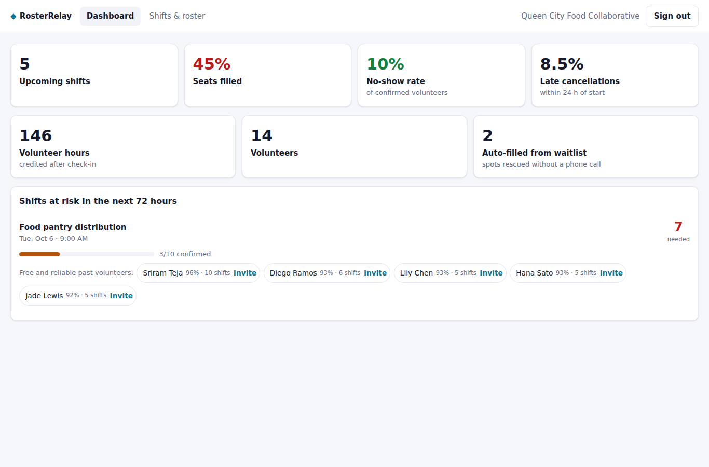
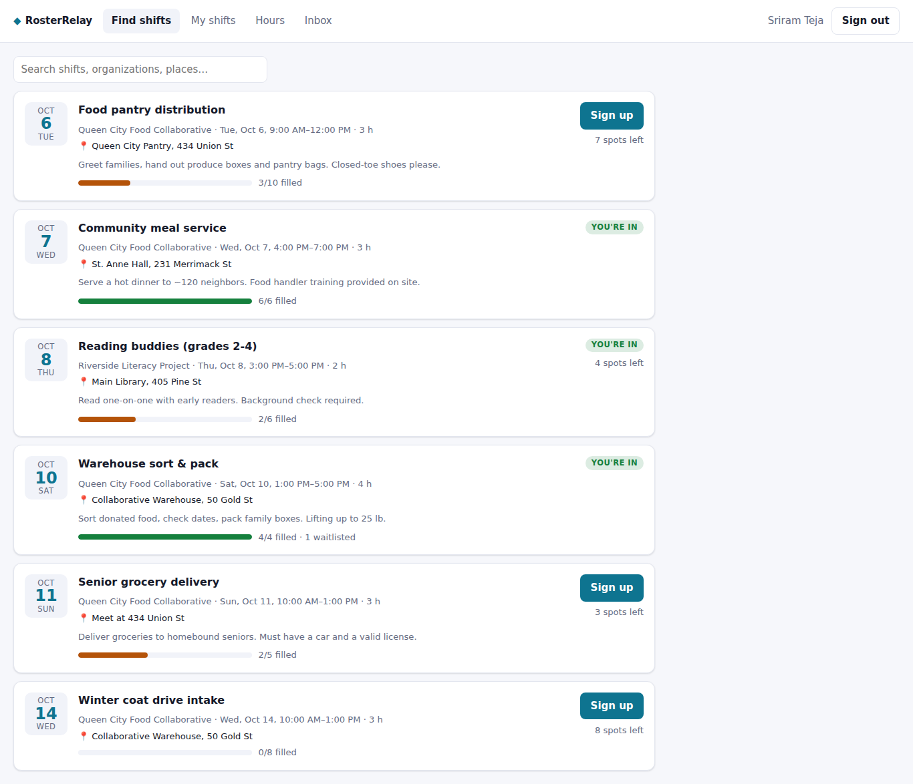
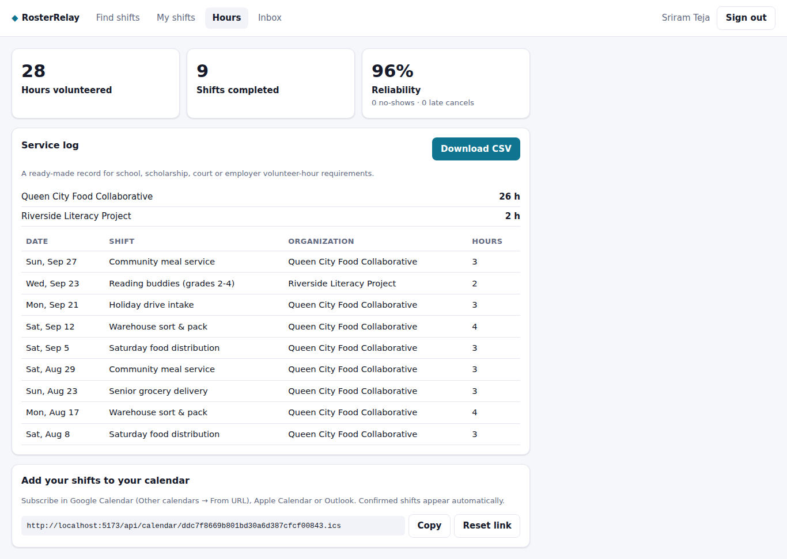
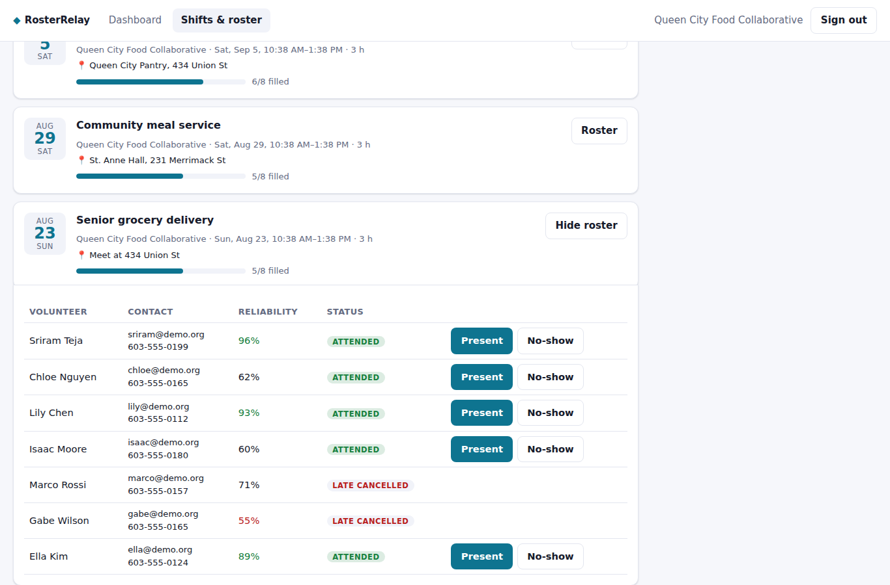

# RosterRelay

**Volunteer scheduling that actually fills shifts.** The name comes from how it works: when one volunteer drops out, their spot is relayed straight to the next person on the waitlist.

Nonprofits post shifts, volunteers sign up in one click, and when someone cancels the next person on the waitlist is moved in and notified automatically. Coordinators get a dashboard that flags under-staffed shifts days ahead and suggests the most reliable volunteers who are free to fill them. Volunteers get a downloadable service-hours log and a calendar feed.

    



| Find shifts | Hours & calendar | Roster check-in |
|---|---|---|
|  |  |  |

## The problem

Most small nonprofits still schedule volunteers with spreadsheets, sign-up sheets and group texts. Two things hurt the most:
- **No-shows and last-minute cancellations:** a shift that looked full on Monday is half-empty on Saturday.
- **Refilling a dropped spot is manual:** it takes phone calls the coordinator doesn't have time for.

## What makes it different

| Feature | How it works |
|---|---|
| **Waitlist that refills itself** | When a shift is full, new sign-ups join a numbered waitlist. A cancellation promotes the next person in line instantly and sends them a notification. The dashboard counts these as "spots rescued without a phone call". |
| **Reliability score** | Shows how likely each volunteer is to show up, based on attendance, no-shows and late cancellations (a late cancel counts as half a no-show). A starting allowance means one missed shift doesn't brand a newcomer as unreliable. Coordinators see it on the roster. |
| **Understaffed alerts with suggestions** | Shifts in the next 72 hours that are under 60% filled are flagged. Each comes with the organization's past volunteers who are **free at that time** (no overlapping shift), ranked by reliability, plus a one-click invite. |
| **Late-cancel awareness** | Cancelling inside 24 hours is recorded separately and the volunteer is warned before confirming, which nudges people to cancel early so the waitlist can work. |
| **Double-booking protection** | Volunteers can't confirm two shifts that overlap. The error names the conflicting shift. |
| **Check-in → verified hours** | The coordinator marks each volunteer Present or No-show once the shift starts. Hours are credited only for attendance and roll into a **CSV service log** suitable for school, scholarship, court or employer hour requirements. |
| **Calendar feed** | Each volunteer gets a private iCalendar (`.ics`) link that Google, Apple and Outlook can subscribe to. It includes a 2-hour reminder alarm, the link can be reset if leaked, and the format follows the iCalendar standard (RFC 5545: escaping, line folding, CRLF line endings). |
| **Automatic reminders** | A scheduled job reminds confirmed volunteers 24 hours ahead, exactly once per sign-up. |

## Production concerns covered

- **Security:**
  - JWT login with Volunteer and Coordinator roles, checked at the URL level for `/api/coordinator/**` and at the method level.
  - Coordinators can only see their own shifts and rosters; the calendar feed uses a random 128-bit secret link.
  - BCrypt password hashing and lockout after 5 failed logins.
- **Correctness:** optimistic locking on shifts, a strict sign-up status workflow with clear `409` errors, validation (shifts end after they start and last at most 12 h; capacity between 1 and 500), and a CSV export protected against spreadsheet formula injection.
- **Notifications:** an in-app inbox, with a single `Notifier` component where email or SMS can be plugged in.
- **Tests:** 13 tests.
  - End-to-end through real JWTs: waitlist promotion, late cancels, double-booking, attendance → hours → reliability → CSV, the dashboard's at-risk shifts and suggestions, shift cancellation notices, reminders sent once, the calendar feed with link reset, and role and ownership checks.
  - Plus unit tests for the reliability model.
- **Ops:** Docker images that run as non-root, Docker Compose with PostgreSQL, and GitHub Actions CI covering tests, the frontend build and the Docker builds.

## Architecture

```
React (Vite) ──/api──▶ Spring Boot API ──JPA──▶ PostgreSQL
                          ├─ ReminderJob (@Scheduled)
                          └─ /api/calendar/{token}.ics (public, secret link)
```

```
backend/src/main/java/com/sriram/rosterrelay
├── auth/      JWT + roles, login rate limiting
├── shift/     shifts, coordinator API
├── signup/    sign-ups, waitlist, reliability, hours log, calendar feed
├── notify/    inbox, reminders, notifier
└── insights/  coordinator dashboard, at-risk shifts, suggestions
```

## Run it

```bash
cp .env.example .env          # set JWT_SECRET
docker compose up --build     # web: http://localhost:3000  API: http://localhost:8080
```

Local development: `cd backend && mvn spring-boot:run` (H2 in-memory) and `cd frontend && npm install && npm run dev`.

Tests: `cd backend && mvn verify`

## API overview

| Method | Path | Who |
|---|---|---|
| POST | `/api/auth/register`, `/api/auth/login` | anyone |
| GET | `/api/shifts` | volunteer: upcoming shifts with fill and my status |
| POST | `/api/shifts/{id}/signup` · `/api/signups/{id}/cancel` | volunteer |
| GET | `/api/signups/mine` · `/api/me/hours` · `/api/me/hours.csv` | volunteer |
| GET/POST | `/api/me/notifications` · `/read` | volunteer |
| GET | `/api/calendar/{token}.ics` | public (secret link) |
| GET/POST | `/api/coordinator/shifts` · `/{id}/cancel` · `/{id}/roster` | coordinator |
| POST | `/api/coordinator/signups/{id}/attendance` | coordinator |
| GET | `/api/coordinator/dashboard` | coordinator |
| POST | `/api/coordinator/shifts/{id}/invite/{volunteerId}` | coordinator |

## Configuration

| Setting | Default |
|---|---|
| `app.late-cancel-window` | `PT24H` |
| `app.reminder-lead` / `app.reminder-interval` | `PT24H` / `PT15M` |
| `app.understaffed.horizon` / `fill-threshold` | `PT72H` / `0.6` |
| `JWT_SECRET`, `DB_URL`, `CORS_ORIGINS` | see `application.yml` |

## License

MIT © Sri Ram Teja Ialam
